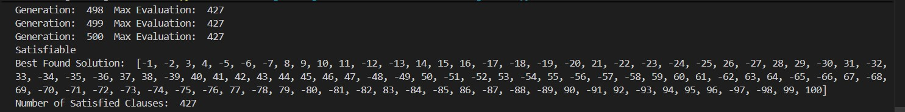
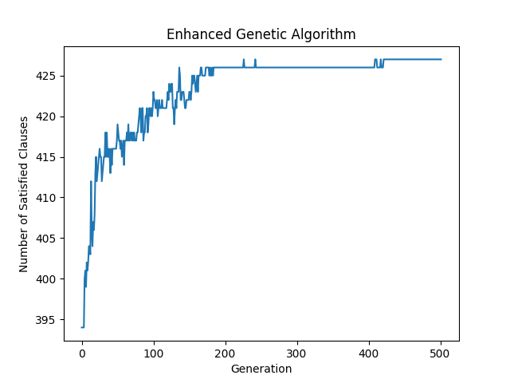

# SAT Solver using Metaheuristic Algorithms

This repository provides implementations of three different metaheuristic algorithms to find solutions for the **Boolean Satisfiability Problem (SAT)**. The input problems are expected to be in the standard **Conjunctive Normal Form (CNF)**.

## 📖 Table of Contents

  * [What is the SAT Problem?](https://github.com/Mohammad-Momeni/SAT-Solver/#what-is-the-sat-problem)
  * [Algorithms Implemented](https://github.com/Mohammad-Momeni/SAT-Solver/#algorithms-implemented)
      * [Simulated Annealing](https://github.com/Mohammad-Momeni/SAT-Solver/#simulated-annealing)
      * [Standard Genetic Algorithm](https://github.com/Mohammad-Momeni/SAT-Solver/#standard-genetic-algorithm)
      * [Enhanced Genetic Algorithm](https://github.com/Mohammad-Momeni/SAT-Solver/#enhanced-genetic-algorithm)
  * [🛠️ Setup and Usage](https://github.com/Mohammad-Momeni/SAT-Solver/#setup-and-usage)
  * [📂 Project Structure](https://github.com/Mohammad-Momeni/SAT-Solver/#project-structure)
  * [📊 Output](https://github.com/Mohammad-Momeni/SAT-Solver/#output)
  * [🤖 Sample](https://github.com/Mohammad-Momeni/SAT-Solver/#sample)

-----

## 🧐 What is the SAT Problem?

The **Boolean Satisfiability Problem** involves determining if there exists an assignment of `True` or `False` values to a set of variables that makes a given Boolean formula true.

This project specifically deals with formulas in **Conjunctive Normal Form (CNF)**. A CNF formula is a conjunction (AND) of one or more clauses, where each clause is a disjunction (OR) of literals. A literal is either a variable or its negation. The goal is to find an assignment that satisfies the maximum number of clauses.

**Example:** $(x\_1 \\lor \\neg x\_2) \\land (\\neg x\_1 \\lor x\_2 \\lor x\_3)$ is a CNF formula. An assignment of $x\_1=\\text{True}, x\_2=\\text{True}, x\_3=\\text{False}$ would satisfy this formula.

-----

## 🤖 Algorithms Implemented

Three different algorithms are used to tackle the SAT problem.

### 1\. Simulated Annealing

This algorithm is a probabilistic technique inspired by annealing in metallurgy. It explores the solution space by starting with a random assignment and iteratively making small changes.

  - **Process**: A random variable in the current solution is flipped to create a new solution.
  - **Acceptance**:
      - If the new solution is better (satisfies more clauses), it is always accepted.
      - If it's worse, it might still be accepted based on a probability `P = exp(-ΔE / T)`, where `ΔE` is the change in quality and `T` is the current temperature. This helps the algorithm escape local optima.
  - **Cooling**: The temperature `T` starts high and gradually decreases with a cooling rate of `0.95`, making the algorithm less likely to accept worse solutions as it progresses.

### 2\. Standard Genetic Algorithm

This algorithm is inspired by the process of natural selection. It evolves a population of solutions over generations to find the best one.

  - **Population**: Starts with a population of 100 random solutions.
  - **Fitness**: The fitness of a solution is the number of clauses it satisfies.
  - **Selection**: Parents are chosen for reproduction using **fitness-proportional selection** (roulette wheel), where solutions with higher fitness have a higher chance of being selected.
  - **Crossover**: Two parents produce two offspring by swapping parts of their binary representations. This occurs with a fixed probability of `0.8`.
  - **Mutation**: A small, random change is introduced into a child solution (two variables are flipped) with a fixed probability of `0.01` to maintain genetic diversity.

### 3\. Enhanced Genetic Algorithm

This is a modified version of the standard genetic algorithm with several improvements to enhance performance and avoid premature convergence.

  - **Rank-Based Selection**: Instead of using raw fitness for selection, solutions are ranked. The selection probability is based on the rank, not the fitness value. This prevents a few highly-fit solutions from dominating the gene pool too early.
  - **Dynamic Parameters**: The crossover and mutation rates are not fixed.
      - The **crossover chance** starts at `0.3` and gradually increases, promoting exploitation as the generations progress.
      - The **mutation chance** starts at `0.7` and gradually decreases, encouraging exploration in the early stages.
  - **Variable Mutation**: The mutation operation flips a random number of variables (from 1 to 5) instead of a fixed number, allowing for more flexible exploration of the search space.

-----

## 🛠️ Setup and Usage

### Prerequisites

Make sure you have Python 3 installed. You will also need the `pysat` and `matplotlib` libraries.

### Installation

1.  **Clone the repository:**
    ```sh
    git clone https://github.com/Mohammad-Momeni/SAT-Solver/
    cd SAT-Solver
    ```
2.  **Install dependencies:**
    ```sh
    pip install python-sat matplotlib
    ```

### Running the Solvers

To run an algorithm, execute its corresponding Python file. Make sure your input `.cnf` file is specified inside the script.

1.  **Modify the input file path:**
    Open the script you want to run (e.g., `SimulatedAnnealing.py`) and change the file path in the last line:

    ```python
    if __name__ == '__main__':
        main('SATs/Your_Input_File.cnf') # Change this path
    ```

2.  **Execute from the terminal:**

    ```sh
    # To run Simulated Annealing
    python SimulatedAnnealing.py

    # To run the Standard Genetic Algorithm
    python StandardGeneticAlgorithm.py

    # To run the Enhanced Genetic Algorithm
    python EnhancedGeneticAlgorithm.py
    ```

-----

## 📂 Project Structure

```
.
├── SATs/
│   └── Input.cnf               # Example input file in CNF format
├── SimulatedAnnealing.py       # Implementation of the Simulated Annealing solver
├── StandardGeneticAlgorithm.py # Implementation of the Standard Genetic Algorithm
├── EnhancedGeneticAlgorithm.py # Implementation of the Enhanced Genetic Algorithm
└── README.md
```

-----

## 📊 Output

For each algorithm, you can expect the following output:

1.  **Live Console Updates**: The progress is printed to the console, showing the current iteration/generation and the number of satisfied clauses.

    ```
    Generation: 100  Max Evaluation: 415
    Generation: 101  Max Evaluation: 415
    ...
    ```

2.  **Final Result**: Once the algorithm terminates, it will print whether the formula is known to be satisfiable and the best solution it found.

    ```
    Satisfiable
    Best Found Solution: [1, -2, 3, ... ]
    Number of Satisfied Clauses: 420
    ```

3.  **Performance Plot**: A plot will be generated and displayed, showing the improvement in the number of satisfied clauses over iterations or generations.

## 🤖 Sample

Here is one sample of running the "EnhancedGeneticAlgorithm":

### Output


### Plot

